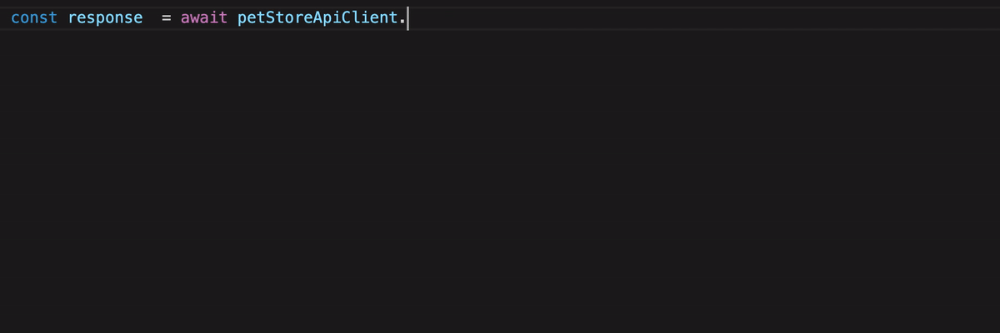

# @mittwald/openapi-to-typescript

> Generate TypeScript types, API clients and React hooks from OpenAPI (and Swagger) specs

<div align="center">
	<br>
	<div>
		
	</div>
	<br>
</div>

## Features

-   OpenAPI V3 support (including validation)
-   Rudimentary Swagger support
-   use CLI or integrate code generation in you own code
-   TS Types for requests: body, headers, path parameters, query parameters
-   TS Types for responses: response types are correctly reflected for different response statuses
-   TS Types for components: makes reuse of types very easy
-   Easy mocking for all API operations
-   Types can be imported separately and reused in your code-base
-   little JavaScript footprint
-   various options to configure transport level settings
-   generation of **React hooks** to easily implement loading of API data in your React components, including different loading states
    (loading, ok, notFound, noAccess, ...), response caching with automatic reloading

## Install

```shell script
$ yarn add -D @mittwald/openapi-to-typescript
```

### Runtime dependencies

Install the following runtime dependency

```shell script
$ yarn add @mittwald/api-client
```

### React hooks

If you want to use React hooks, you also need to install `@mittwald/react-api-hooks`.

```shell script
$ yarn add @mittwald/react-api-hooks
```

## Generating Code

This command generates TypeScript types, a PetStoreApiClient class and React hooks (`--react` flag) for each API operation specified in
`https://petstore3.swagger.io/api/v3/openapi.json`.

```shell script
$ yarn openapi2ts --namespace PetStoreApi --react --output src/api/PetStoreApiClient.ts https://petstore3.swagger.io/api/v3/openapi.json
```

### Supported input formats

-   YAML
-   JSON

### Supported input sources

-   http(s)
-   local files

###

### Help

```shell script
yarn openapi2ts --help
```

### Caveats using Swagger

This library focuses on using OpenAPI specs. However, if you disable the spec validation (`--skipValidation`), you might get an adequate
result with Swagger specs. Just give it a try.

## Creating the API client instance

If you need no custom transport settings, like custom HTTP header, you can just create the client with the API url.

```typescript
import { PetStoreApiClient } from "./api/PetStoreClient";

export const apiClient = new PetStoreApiClient("https://petstore3.swagger.io/api/v3");
```

Instead of the API url, you can also pass an HTTP-Client instance to the constructor. A default implementation can be found in
`@mittwald/api-client/dist/http/KyClient`. The `KyClient` gives you a lot of options that likely fit your need, like custom HTTP headers or
request execution hooks (see https://github.com/sindresorhus/ky#options).

```typescript
import { PetStoreApiClient } from "./api/PetStoreClient";
import { KyClient } from "@mittwald/api-client/dist/http/KyClient";

const apiClient = new PetStoreApiClient(
    new KyClient({
        // ky options (see https://github.com/sindresorhus/ky#options for more)
        ky: {
            prefixUrl: "https://petstore3.swagger.io/api/v3",
        },
        defaultHeaders: {
            Authorization: "Bearer some-token",
        },
    }),
);
```

If you are not fine with the `KyClient` implementation, you can build your own, by implementing the `Client` interface from
`@mittwald/api-client/dist/http/Client`.

## Using the API client

The generated API client has async methods for each operation defined in the specification. Thanks to the complete TypeScript support, you
can just use your IDEs auto completion to use the API in a convenient and accurate way.

```typescript
const petsResponse = await apiClient.findPetsByTags({ query: { tags: ["furry", "cute"] } });

if (petsResponse.status !== 200) {
    throw new Error("Something went wrong");
}

const petNames = petsResponse.content.map((pet) => pet.name);
```

## Mocking of requests

Request mocking lets you mock responses for certain API requests.

In order to use request mocking, you need first need to add `fetch-mock`

```shell script
$ yarn add -D fetch-mock
```

Then you can use the mocking functions from the `<output>.mocks.ts` file, like this

```typescript
import { petStoreApiRequestMocking } from "./api/PetStoreClient.mocks";

// With static response
petStoreApiRequestMocking.mockAddPet(
    {
        // Mocks all requests, where the name is "Cat"
        requestBody: {
            name: "Cat",
        },
    },
    {
        status: 200,
        content: {
            id: 123,
            photoUrls: ["https://www.cat.com/me.jpg"],
            name: "Cat",
        },
    },
);

let petId = 1;

// With dynamic response
petStoreApiRequestMocking.mockAddPet({}, (req) => ({
    content: {
        ...req.requestBody,
        id: ++petId,
    },
    status: 200,
}));
```

### Using wildcards in Path parameters

If your request path contains parameters, you can also use wildcards, to mock all requests. To use the actual param in the mocked response,
you can use the response factory function and access the `req.path.myParam` property.

```typescript
import { petStoreApiRequestMocking } from "./api/PetStoreClient.mocks";

petStoreApiRequestMocking.mockGetPet(
    {
        // Mocks all requests
        path: {
            id: "*",
        },
    },
    (req) => ({
        content: {
            // you can get the actual param from the request
            id: req.path.id,
            name: `Cat ${req.path.id}`,
        },
        status: 200,
    }),
);
```

## Using React hooks

If you have enabled the React hook generation with the `--react` flag, you get data loading hooks for each API operation.

### Setup

In order to use the hooks, an API client instance must be set first.

```typescript
import { PetStoreApiClient } from "./api/PetStoreClient";

export const apiClient = new PetStoreApiClient("https://petstore3.swagger.io/api/v3");

// Set the instance to use React hooks!
PetStoreApiClient.setInstance(apiClient);
```

### Example

```tsx
const PetStatus: FC<{ id: string }> = (props) => {
    const petResponse = useGetPetById({ path: { petId: props.id } });

    const pet = petResponse.data;

    return (
        <>
            <h1>{pet?.name || <Skeleton />}</h1>
            <LoadingSpinner visible={petResponse.state === "loading"} />
            <p>{pet?.status || <Skeleton />}</p>
        </>
    );
};
```

### Short-circuit request

The rules of hooks do not allow conditional calling of hooks, but you can use `null` as request to short-circuit executing the request.

If `null` is used the response is in state `loading`.

```tsx
const petResponse = useGetPetById(someCondition ? { path: { petId: props.id } } : null);
};
```

### Using the cache

When using the React hooks all API responses are automatically cached. So when using a hook with the same request parameters twice, the API
will actually not be requested again.

### Clearing the cache

There are several ways to clear the cache.

#### 1. Use the hook un-cached

```typescript
const petResponse = useGetPetById({ path: { petId: props.id } }, { disableCache: true });
```

#### 2. Clear the whole cache

```typescript
import clearCache from "@mittwald/react-api-hooks/dist/lib/clearCache";

clearCache();
```

#### 3. Clear a specific cache

Clear the cache by using the hook result:

```tsx
const PetStatus: FC<{ id: string }> = (props) => {
    const petResponse = useGetPetById({ path: { petId: props.id } });

    const pet = petResponse.data;

    return (
        <>
            <h1>{pet?.name || <Skeleton />}</h1>
            <p>{pet?.status || <Skeleton />}</p>
            <button onClick={petResponse.refreshCache}>Reload</button>
        </>
    );
};
```

Clear the cache by using the global cache object:

```typescript
import { petStoreApiCache } from "./api/PetStoreClient";

petStoreApiCache.refreshFindPetsByTags({ query: { tags: ["furry", "cute"] } });
```
